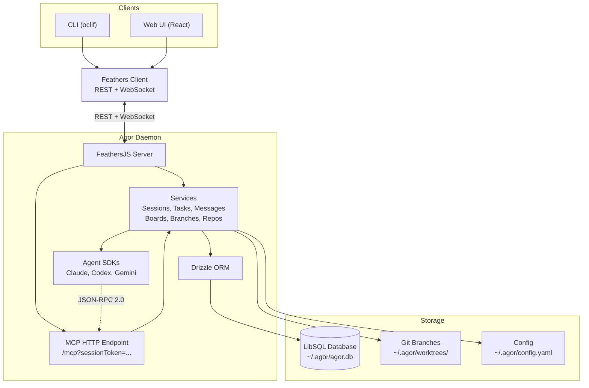

# Agor

**Team command center for all things agentic.**

Agor is a shared canvas where coding agents (Claude Code, Codex, Gemini) and long-lived assistants run side-by-side on isolated git branches — the anchor entity where sessions, dev environments, prompts, and PRs converge. Your whole team rallies around the same live work in real time, and the agents themselves drive Agor over MCP.

- **Team workspace for AI agents** — multiplayer is the core differentiator. Live cursors, facepile, scoped comments, shared sessions and dev envs.
- **Branches as the anchor** — one entity per piece of work, where conversations + dev env + PR + prompts all converge.
- **Multi-agent, multi-runtime** — Claude Code, Codex, Gemini, OpenCode, Copilot, interchangeable per session.
- **Shared, long-lived assistants** — persistent agents with identity, memory, and skills that you publish for the whole team.
- **Self-hosted** — your repos, your DB, your isolation posture.

**📖 [Read the full documentation at agor.live →](https://agor.live/)**

---

## See It In Action

<div align="center">
  <table>
    <tr>
      <td width="50%">
        
        <p align="center"><em style="opacity: 0.5;">Spatial canvas with branches and zones</em></p>
      </td>
      <td width="50%">
        
        <p align="center"><em style="opacity: 0.5;">Rich web UI for AI conversations</em></p>
      </td>
    </tr>
    <tr>
      <td width="50%">
        
        <p align="center"><em style="opacity: 0.5;">MCP servers and branch management</em></p>
      </td>
      <td width="50%">
        
        <p align="center"><em style="opacity: 0.5;">Live collaboration with cursors and comments</em></p>
      </td>
    </tr>
  </table>
</div>

**[→ Watch unscripted demo on YouTube](https://www.youtube.com/watch?v=3in0qh7ZH0g)** (13 minutes)

---

<div align="center">
  <h3>✨ Pledge ✨</h3>
  <p><strong>⭐️ I pledge to fix a GitHub issue for every star Agor gets :)</strong></p>
</div>

---

## Quick Start

Requires **Node.js ≥ 22.12** ([install](https://nodejs.org)).

```bash
npm install -g agor-live
```

Prefer Homebrew on macOS or Linux? See the [Getting Started guide](https://agor.live/guide/getting-started) for the brew install path.

```bash
agor init           # creates ~/.agor/ and database
agor daemon start   # runs in the background
agor open           # opens the UI
```

That's it. Visit [agor.live/guide/getting-started](https://agor.live/guide/getting-started) to add a repo and create your first session — the onboarding wizard takes it from there.

For Docker, source builds, Postgres, and team setups, see [Extended Installation](https://agor.live/guide/extended-install).

---

## What is Agor?

Agor is built on three foundational concepts:

- **[Branches](https://agor.live/guide/branches)** — the unit of work. A git branch pinned to a board, with its own branch, isolated environment, and conversations.
- **[Sessions & Trees](https://agor.live/guide/sessions)** — agent conversations with genealogy. Fork to explore alternatives, spawn subsessions for focused subtasks.
- **[Boards & Zones](https://agor.live/guide/boards)** — a Figma-style 2D canvas of branches. Drop a branch into a zone to trigger a templated prompt.

Everything else builds on these. **[Read the Features Overview →](https://agor.live/guide/features-overview)**

---

## Features

- **[Assistants](https://agor.live/guide/assistants)** — long-lived AI companions with file-based memory and skills, OpenClaw-style.
- **[Agor MCP Server](https://agor.live/guide/internal-mcp)** — anything a user can do in Agor, an agent can do too. Sessions are auto-issued an MCP token.
- **[Rich Chat UX](https://agor.live/guide/rich-chat-ux)** — per-prompt token + dollar accounting, model/effort selectors, structured tool blocks, completion chimes.
- **[Multiplayer & Social](https://agor.live/guide/multiplayer-social)** — live cursors, facepiles, spatial comments, shared multiplayer terminal.
- **[Environments](https://agor.live/guide/environment-configuration)** — one-click dev servers per branch with auto-managed unique ports.
- **[Scheduler](https://agor.live/guide/scheduler)** — cron-style triggers for templated prompts. Powers assistant heartbeats and automated audits.
- **[Cards](https://agor.live/guide/cards)** (Beta) — generic workflow entities for non-code workflows.
- **[Artifacts](https://agor.live/guide/artifacts)** — live, interactive applications rendered on the board via Sandpack.
- **[Message Gateway](https://agor.live/guide/message-gateway)** — Slack and GitHub as portals to Agor sessions.

---

## Screenshots

<div align="center">
  
  <p style="opacity: 0.5;"><em>Multiplayer canvas with live cursors, rich branch cards, zones, and interactive agent dashboards</em></p>
</div>

<div align="center">
  <table>
    <tr>
      <td width="50%">
        
        <p align="center"><em style="opacity: 0.5;">Task-centric conversation UI</em></p>
      </td>
      <td width="50%">
        
        <p align="center"><em style="opacity: 0.5;">MCP server and branch management</em></p>
      </td>
    </tr>
    <tr>
      <td width="50%">
        
        <p align="center"><em style="opacity: 0.5;">Zone trigger modal on session drop</em></p>
      </td>
      <td width="50%">
        
        <p align="center"><em style="opacity: 0.5;">Zone trigger configuration</em></p>
      </td>
    </tr>
    <tr>
      <td width="50%">
        
        <p align="center"><em style="opacity: 0.5;">Branch environment setup</em></p>
      </td>
      <td width="50%">
        
        <p align="center"><em style="opacity: 0.5;">Session creation with agent selection</em></p>
      </td>
    </tr>
    <tr>
      <td width="50%">
        
        <p align="center"><em style="opacity: 0.5;">Built-in terminal with branch context</em></p>
      </td>
      <td width="50%">
        
        <p align="center"><em style="opacity: 0.5;">Welcome screen showing team status</em></p>
      </td>
    </tr>
  </table>
</div>

---

## Architecture



**[Full Architecture Guide →](https://agor.live/guide/architecture)**

---

## Development

**[Development Guide →](https://agor.live/guide/development)**

Quickest path — run Agor from source via Docker:

```bash
git clone https://github.com/preset-io/agor.git
cd agor
docker compose up
```

The repo's `.agor.yml` defines variants (sqlite / postgres / full / docs) so you can spin up the exact dev setup you need. The dev guide also covers running Agor _inside_ Agor for dogfooding, plus custom builds via `packages/agor-live/build.sh`.

---

## Roadmap

**[View roadmap on GitHub →](https://github.com/preset-io/agor/issues?q=is%3Aissue+state%3Aopen+label%3Aroadmap)**

Highlights:

- **Match CLI-Native Features** — SDKs are evolving rapidly and exposing more functionality. Push integrations deeper to match all key features available in the underlying CLIs
- **Bring Your Own IDE** — Connect VSCode, Cursor, or any IDE directly to Agor-managed branches via SSH/Remote
- **Unix User Integration** — Enable true multi-tenancy with per-user Unix isolation for secure collaboration. [Read the guide →](https://github.com/preset-io/agor/blob/main/apps/agor-docs/pages/guide/multiplayer-unix-isolation.mdx)

---

## Community

- **[Discord](https://discord.gg/Qh4TrFQZpd)** - Join our Discord community for support and discussion
- **[GitHub Discussions](https://github.com/preset-io/agor/discussions)** - Ask questions, share ideas
- **[GitHub Issues](https://github.com/preset-io/agor/issues)** - Report bugs, request features

---

## About

**Heavily prompted by [@mistercrunch](https://github.com/mistercrunch)** ([Preset](https://preset.io), [Apache Superset](https://github.com/apache/superset), [Apache Airflow](https://github.com/apache/airflow)), built by an army of Claudes.

Read the story: [Making of Agor →](https://agor.live/blog/making-of-agor)
