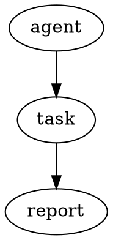

# Streamdown rich-content extensions POC

**Date:** 2026-07-14  
**Status:** POC — GitHub-style callouts enabled; Vega-Lite available only on the demo route behind an explicit prop  
**Decision:** Keep the scope to one genuinely new analytical capability and one small, portable Markdown convention.

## Executive decision

This POC implements only:

1. **Vega-Lite** for a closed ````vega-lite`fenced block. It uses Streamdown 2's documented custom-renderer API and keeps the chart runtime behind two dynamic-import boundaries. The renderer is deliberately default-off and enabled only by`/demo/streamdown`; ordinary conversation/Knowledge/card rendering keeps the fence as code until the remaining production gates are approved.
2. **GitHub-style callouts** (`> [!NOTE]`, `> [!WARNING]`, and the other three GitHub alert types). The source remains a normal blockquote everywhere else.

It does **not** add a generic JSON/YAML inspector, ANSI renderer, another diff system, Graphviz, D2, or PlantUML. JSON, YAML, diff, DOT, D2, PlantUML, and plain terminal text continue to be readable and copyable fenced code. Agor already has context-aware diff and ANSI components where structured tool output makes their semantics unambiguous, and Mermaid is already the conversation diagram language.

This is deliberately an integration POC, not a renderer rewrite.

## Decision matrix

| Candidate                  | Decision                | Portable source                                                                                                                                      | Measured/expected cost                                                                                                                                                     | Maturity and reason                                                                                                                                                                                                                                                 |
| -------------------------- | ----------------------- | ---------------------------------------------------------------------------------------------------------------------------------------------------- | -------------------------------------------------------------------------------------------------------------------------------------------------------------------------- | ------------------------------------------------------------------------------------------------------------------------------------------------------------------------------------------------------------------------------------------------------------------- |
| **Vega-Lite**              | **Implement demo POC**  | High: a `vega-lite` JSON fence remains readable/copyable; several Markdown tools already recognize the language name even when they do not render it | **226,531 B gzip lazy** (renderer + Vega runtime); **32,585 B gzip initial delta** in the current-main control comparison because Vega shares some D3 modules with Mermaid | Vega 6.2.0, Vega-Lite 6.4.3, and Vega-Embed 7.1.0 were current and maintained at research time. Streamdown documents this exact custom-renderer use case, but does not publish an official Vega plugin. High value, but default-off pending production approval.    |
| **JSON/YAML tree + table** | **Defer**               | High for the standard `json`/`yaml` fences                                                                                                           | Existing Streamdown code highlighting is already in the initial chunk; a second renderer would add interaction, virtualization, and schema decisions                       | Syntax highlighting and copy already work. “Table” is ambiguous for nested/mixed data, while a tree duplicates editor/inspector UI elsewhere in Agor. Revisit only with a specific conversation workflow and large-document accessibility design.                   |
| **Rich diff**              | **Defer**               | High for a standard `diff` fence                                                                                                                     | No new package is needed for highlighting; a richer viewer would need parsing and side-by-side/large-file behavior                                                         | Streamdown already highlights `diff`. Agor's `DiffBlock` already renders structured Edit/Write results and Knowledge history, where old/new file semantics are known. A generic fence does not reliably carry those semantics.                                      |
| **ANSI terminal**          | **Defer**               | Medium: an `ansi` fence is readable only if the source contains printable text; raw escape bytes travel poorly                                       | `ansi-to-react` 6.2.6 is already installed (12,227 B package files), but promoting it to Markdown expands the untrusted-input surface                                      | Agor already uses ANSI rendering for terminal/tool output. Conversation Markdown should not interpret cursor movement, OSC links, OSC 52, or non-SGR terminal controls. A future renderer would need a strict SGR-only tokenizer, output caps, and plain-text copy. |
| **Callouts/admonitions**   | **Implement POC**       | **High:** follows GitHub's five alert types and degrades to an ordinary blockquote                                                                   | `remark-github-blockquote-alert` 2.1.0 is 38,720 B unpacked with one already-present dependency; its production bundle effect is part of the small initial delta below     | Small, active, no executable payload, and no Agor-specific Markdown. Styling restores only a five-value closed set after Streamdown sanitization.                                                                                                                   |
| **Graphviz/DOT**           | **Defer**               | High for a `dot` fence                                                                                                                               | `@viz-js/viz` 3.28.0 is **4,982,950 B unpacked** before a measured Agor bundle; it carries the Graphviz WASM/runtime cost                                                  | Capable and standard, but it overlaps Mermaid and introduces WASM/worker/CSP, layout-DoS, SVG sanitization, and accessibility work. Only justify it for a concrete DOT-heavy workflow.                                                                              |
| **D2**                     | **Reject for this POC** | High for a `d2` fence                                                                                                                                | No official `d2-wasm` package was present on npm under that name; browser approaches add WASM or a service                                                                 | Overlaps Mermaid and DOT without enough Agor-specific value to justify another diagram runtime. Reconsider only if D2 becomes a user requirement with a maintained browser renderer.                                                                                |
| **PlantUML**               | **Reject for this POC** | High for a `plantuml` fence                                                                                                                          | `plantuml-encoder` 1.4.0 is 298,967 B unpacked but is only an encoder and was last published in 2022; rendering still needs a server or a much heavier Java/WASM path      | A remote server leaks diagram text and adds availability/CSP concerns; local rendering is heavyweight. It also overlaps Mermaid.                                                                                                                                    |

Package sizes above are actual installed-file totals or npm tarball `dist.unpackedSize`, not bundle-size guesses. Production bundle measurements are in [Bundle evidence](#bundle-evidence).

## Existing Agor integration audited

- `MarkdownRenderer` is shared by conversations, streaming text, Knowledge documents, Markdown modals/previews, comments, branch/card content, and canvas Markdown nodes. Vega is therefore an explicit `enableVegaLite` opt-in rather than a global plugin; only the demo opts in. Callouts use the shared renderer because they are low-risk portable Markdown.
- Before this branch Agor used Streamdown 1.5.1. It supplied code highlighting, Mermaid, math, GFM, incomplete-Markdown repair, and control/copy UI. Streamdown 2.5.0 moves CJK, code, Mermaid, and math into explicit official plugin packages; all four are registered here so the upgrade does not intentionally drop an existing capability.
- Streaming passes `mode="streaming"`, `parseIncompleteMarkdown`, and Streamdown's `isIncomplete` renderer flag. A half-written Vega-Lite fence renders as ordinary copyable code and does not request the renderer or Vega runtime. The chart is attempted only after the fence closes.
- Streamdown's default rehype pipeline still performs raw HTML parsing, sanitization, and URL hardening before React rendering. The alert plugin's arbitrary classes are stripped; Agor restores only `note`, `tip`, `important`, `warning`, and `caution` at the React boundary.
- The renderer does not rewrite persisted source. Copy/export therefore remains the original Markdown. When Streamdown controls are enabled, successful charts have a “View Vega-Lite source” disclosure and copy button; malformed, rejected, incomplete, timed-out, and error-boundary cases show the original fenced code. `showControls={false}` is honored in compact contexts.
- Existing `AnsiText` remains limited to tool/environment output, and existing `DiffBlock` remains limited to structured edit/history paths.
- Theme colors come from Ant Design tokens. Vega uses the dark theme when Agor is dark, a transparent background, and token-derived text/grid colors.

## Streamdown/API and browser findings

- Streamdown 2.5.0 is the current installed POC version. Its [custom-renderer documentation](https://streamdown.ai/docs/custom-renderers) defines `CustomRendererProps` (`code`, `language`, `isIncomplete`, `meta`) and includes a dynamically imported Vega-Lite example.
- Streamdown's official extension packages used here are [`@streamdown/code`](https://streamdown.ai/docs/plugins/code), `@streamdown/mermaid`, `@streamdown/math`, and `@streamdown/cjk`. There is no official `@streamdown/vega` package; this POC uses the public renderer API.
- Streamdown's [security documentation](https://streamdown.ai/docs/security) documents its sanitize/harden pipeline and KaTeX strict mode. Custom renderers remain responsible for their own payloads.
- Streamdown 2's parser stack uses modern JavaScript features. An open upstream compatibility report describes a regex-lookbehind crash on iOS 16 / Safari before 16.4. Agor's current Vite target is modern browsers, but this should be checked against the supported-browser policy before production rollout.
- The upgrade is not cost-free: Streamdown 2.5's explicit plugin setup increases Agor's already-large initial Streamdown chunk even with Vega removed. That cost is separated from the Vega cost below.

## Vega-Lite security and resource policy

Conversation content is untrusted. A recursive denylist cannot prove a safe Vega-Lite subset because seemingly small configuration and transform options can generate enormous layouts or datasets. The POC therefore uses a deliberately small explicit allowlist:

- One unit chart only. The root may contain only `$schema`, `description`, `title`, `width`, `height`, `data`, `mark`, and `encoding`. Authored transforms, composition/faceting/repeat, padding/spacing, configuration, projections, parameters, expressions, and generated datasets are outside the subset and remain ordinary source code.
- JSON source is capped at 100,000 UTF-8 bytes, depth 32, 10,000 visited values, and 2,000 items per array. Both dimensions are required: width is a finite nonnegative number up to 2,000 or exact `"container"`; height is a finite nonnegative number up to 2,000. Step sizing and coercible values are rejected.
- Data must be `{ "values": [...] }` with at most 2,000 object rows containing only finite JSON primitives. Data field names such as `width`, `height`, `url`, or `href` are ordinary data rather than being misclassified as configuration.
- `mark` must be one of ten reviewed static mark names; authored mark objects/geometry are rejected. Encoding uses a closed list of field channels and field-definition properties. Field types and aggregates are enumerated; binning is boolean-only; guide configuration may only be disabled with `null`. Scale, condition, expression, value/datum, and other unaudited encoding forms are rejected.
- Remote loads are not expressible through the allowlist. Vega-Embed hover processing is disabled as an additional static-chart constraint.
- Vega-Embed receives an inline object, `actions: false`, `tooltip: false`, SVG output, and `ast: true`. Vega documents `ast: true` as the CSP-compatible expression-interpreter path; the default expression compiler otherwise uses `Function` construction.
- A custom Vega loader rejects both `load` and `sanitize`, providing defense in depth if a resource-bearing property escapes validation. No chart-initiated fetch is allowed.
- SVG is produced by the local Vega runtime rather than accepted as authored HTML. The normal Streamdown sanitizer still applies to surrounding Markdown.
- A shared per-source budget at the custom-renderer boundary activates at most four Vega charts in one Markdown document. It counts the fences Streamdown actually parses—including blockquotes and list items—rather than approximating syntax with a regex. Excess renderers and gates mounted without the owning budget provider fail closed to ordinary code. Completed charts load only within 400 px of the viewport.
- The component chunk has a separate 15-second load timeout and preserves the source fence while pending or failed. Chart execution has a five-second timeout and cleanup/finalization on unmount. The execution timer starts after the lazy Vega runtime loads, so a cold Docker/Vite compile is not mistaken for expensive chart work. This improves failure UX but **cannot preempt synchronous main-thread layout work**. The default-off boundary and input caps reduce risk; production approval should still include adversarial profiling or isolation if Vega proves able to monopolize the main thread.
- The figure exposes the spec's `description` as an accessible name. A generic accessible description is inserted if omitted. Vega SVG accessibility remains enabled by default. The loading state uses `aria-busy`/`aria-live`; errors use `role="alert"` and retain source.

References: [Vega usage and CSP](https://vega.github.io/vega/usage/), [Vega data loading](https://vega.github.io/vega/docs/data/), [Vega-Embed options](https://vega.github.io/vega-embed/index.html), and [Vega-Lite accessibility configuration](https://vega.github.io/vega-lite/docs/config.html).

## Lazy-loading verification

Dynamic import alone was not accepted as evidence. Production builds were compared, and the generated HTML/module graph was inspected.

1. With the named Vega `manualChunks` rule, `index.html` contains **no** `vega` or `VegaLiteRenderer` script/preload. The demo-enabled gate dynamically imports `VegaLiteRenderer`, which dynamically imports the named `vega` chunk.
2. A control build with the Vega rule temporarily removed was also run. Rolldown merged the Vega graph into the statically preloaded `streamdown` chunk (14,963,908 B raw / 3,236,387 B gzip). In other words, the naive dynamic imports were **not sufficient** in this bundle graph.
3. A streaming incomplete fence does not render the lazy component, verified by a focused DOM test. Only a closed fence requests the async renderer.

The explicit chunk boundary is therefore required, not cosmetic.

## Bundle evidence

Production builds used `pnpm --filter agor-ui build`. Sizes below are generated asset bytes; gzip uses the build's `.gz` output. “Initial” is the set referenced or module-preloaded by `index.html`, so it distinguishes startup cost from chart-only cost.

| Current-main comparison build                            |  Initial raw | Initial gzip |                     Vega delta |
| -------------------------------------------------------- | -----------: | -----------: | -----------------------------: |
| Callouts + Streamdown parity, Vega renderer removed      | 17,653,015 B |  4,000,440 B |                              — |
| Final demo-only POC with Vega registration and hardening | 17,744,582 B |  4,033,025 B | +91,567 B raw / +32,585 B gzip |

An earlier same-main comparison measured the Streamdown 1.5.1 → 2.5.0 parity-plugin upgrade at +815,513 B raw / +154,196 B gzip. That upgrade cost is separate from the Vega delta above.

Final chart-only chunks:

| Lazy chunk                              |           Raw |          Gzip |
| --------------------------------------- | ------------: | ------------: |
| `VegaLiteRenderer`                      |       9,170 B |       3,739 B |
| `vega` runtime                          |     653,271 B |     222,792 B |
| **Lazy total on first completed chart** | **662,441 B** | **226,531 B** |

The initial Streamdown asset remains the dominant renderer cost and warrants separate optimization; this POC does not attempt that rewrite.

Installed direct package files (uncompressed): Streamdown 97,846 B; Vega 3,522,157 B; Vega-Lite 5,814,897 B; Vega-Embed 601,357 B; callout plugin 38,720 B. Disk/tarball size is intentionally reported separately from tree-shaken production bytes.

## Test Markdown

These examples also live on `/demo/streamdown`.

### Vega-Lite

````markdown
```vega-lite
{
  "description": "Weekly completed tasks",
  "width": "container",
  "height": 240,
  "data": {
    "values": [
      { "day": "Mon", "tasks": 3 },
      { "day": "Tue", "tasks": 7 },
      { "day": "Wed", "tasks": 5 },
      { "day": "Thu", "tasks": 9 }
    ]
  },
  "mark": "bar",
  "encoding": {
    "x": { "field": "day", "type": "ordinal", "title": "Day" },
    "y": { "field": "tasks", "type": "quantitative", "title": "Completed tasks" },
    "color": { "field": "tasks", "type": "quantitative", "legend": null }
  }
}
```
````

Malformed/streaming fallback:

````markdown
```vega-lite
{"mark":"bar"
```
````

Blocked remote data:

````markdown
```vega-lite
{"data":{"url":"https://example.com/private.csv"},"mark":"line"}
```
````

### GitHub callouts

```markdown
> [!NOTE]
> This source remains an ordinary blockquote outside a supporting renderer.

> [!WARNING]
> Review the chart's source before relying on the result.
```

### Deliberately ordinary fallbacks

````markdown
```diff
- old behavior
+ new behavior
```

```json
{ "nested": { "value": 42 } }
```

```yaml
nested:
  value: 42
```


````

## Focused validation

- `pnpm --filter agor-ui test -- src/components/MarkdownRenderer/MarkdownRenderer.test.tsx src/components/MarkdownRenderer/VegaLiteRenderer.test.tsx src/components/MarkdownRenderer/vegaLiteSpec.test.ts src/components/MarkdownRenderer/vegaRendererLoader.test.ts`
  - 4 files, 47 tests passing
  - covers default-off and renderer-boundary budgets (top-level, blockquote, list fences, and missing ownership), the explicit unit-chart grammar including optional `count` fields, ordinary data fields named `width`/`height`/`url`/`href`, huge padding/spacing/mark-geometry/density regressions, callouts, incomplete streaming, malformed/static-subset rejection, dark theme, both lazy/runtime timeouts, late finalization, control parity, accessibility, CSP mode, and blocked network loading
- `pnpm --filter @agor/core test -- src/templates/session-context.test.ts` — 1 test passing; verifies the shared agent Markdown guidance
- `pnpm --filter agor-ui typecheck` — passing
- `pnpm exec biome check` on all changed UI source/config/package files — passing
- `pnpm --filter agor-ui build` — passing; measurements above
- Managed SQLite environment at `/demo/streamdown` — visually inspected in dark mode: Vega SVG, source disclosure, and both callout styles rendered with no browser console errors; existing Mermaid, math, and highlighted code also rendered. After the Docker timeout fix, a fresh Chrome profile rendered the responsive chart in 4.99 seconds with no alert or console warning/error.

## Production follow-ups (not part of this POC)

1. Decide whether the Streamdown 2 initial-bundle regression is acceptable or can be reduced upstream/before rollout.
2. Profile the maximum allowed workload (four near-viewport charts with 2,000 primitive rows each) on low-end hardware. A JavaScript timeout is not a CPU preemption boundary.
3. Confirm the product's minimum Safari/iOS version against Streamdown 2's parser compatibility.
4. If Vega is approved, consider requiring authors to provide `description` rather than accepting the generic fallback.
5. Do not add a second diagram language without measured user demand and an independent security/accessibility review.
